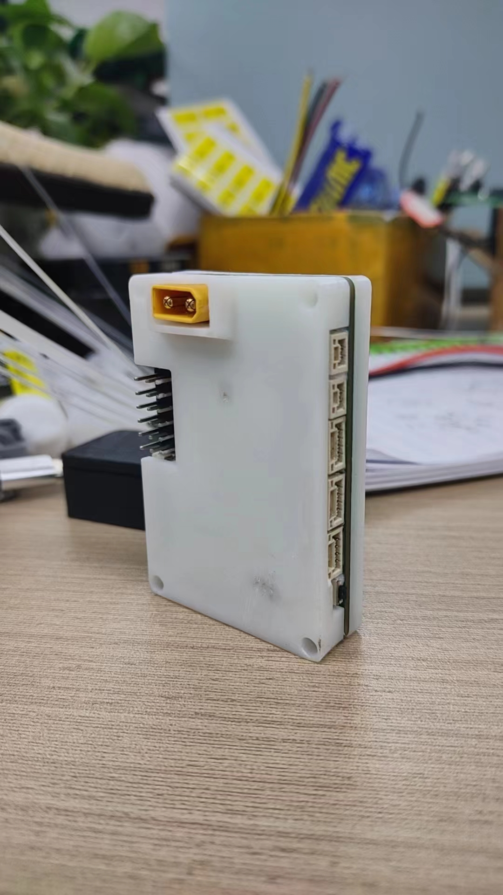
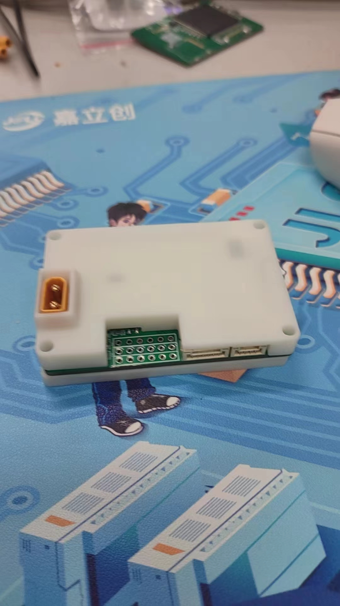

# Master Control Board v1.0.0

<div align="center">

**面向机器人控制系统的开源 STM32 主控板**<br>
*An open-source STM32 control board for robotics projects*

[](LICENSE)

[快速开始](#快速开始) · [文档导航](#文档导航) · [更新日志](CHANGELOG.md)

</div>

<p align="center">
  
  
</p>

## 项目简介

Master Control Board 是一块以 **STM32F407VET6** 为核心、集成 **BMI270 六轴 IMU** 的机器人主控板，定位类似 DJI C Board 的通用控制核心。项目已在 RM 比赛项目中实际使用。本仓库提供 `v1.0.0` 的 PCB、固件、外壳和制造资料。

Master Control Board `v1.0.0` includes hardware design files, firmware, enclosure models and manufacturing files. The board has been used in RM competition projects; formal electrical and environmental test reports are still incomplete.

## 主要特性

| 功能 | 说明 |
| --- | --- |
| MCU | STM32F407VET6，LQFP100，Cortex-M4F |
| IMU | Bosch BMI270，SPI2 接口 |
| 实时系统 | FreeRTOS / CMSIS-RTOS v1 |
| 总线 | CAN1、CAN2（当前 CubeMX 配置为 1 Mbps） |
| 串行接口 | USART1/2/3/6、UART4/5 |
| 其他外设 | SPI1、SPI2、IWDG、RGB 指示灯、激光/外部中断接口 |

## 快速开始

1. 安装 STM32CubeMX、Keil MDK-ARM 和对应的 STM32F4 Device Pack。
2. 用 Keil 打开 [Luq Board.uvprojx](src/firmware/MDK-ARM/Luq%20Board.uvprojx)，选择 `Luq Board` target 后编译。
3. 使用 ST-Link 或 J-Link 烧录生成的固件；仓库也保留了 [v1.0.0 固件镜像](releases/v1.0.0/Luq_Board_v1.0.0.hex)。
4. 制作硬件时，从 [PCB 工程](hardware/pcb/luq_board.eprj) 和 [制造资料](hardware/pcb/manufacturing/) 开始。

完整的环境、编译、烧录与制造入口见 [快速开始](docs/getting-started.md)。制作前请结合板厂能力核对叠层、阻抗和器件封装。

## 目录结构

```text
.
├── src/
│   └── firmware/              # CubeMX、Keil、应用源码与第三方驱动
├── hardware/
│   ├── pcb/                   # PCB 工程、Gerber、BOM 与贴片坐标
│   ├── mechanical/            # 外壳与 3D CAD 文件
│   └── datasheets/            # 芯片参考资料
├── releases/
│   └── v1.0.0/                # 随项目保存的固件镜像
├── tools/
│   └── stm-studio/            # IMU 观察配置
├── docs/
│   ├── README.md              # 文档导航
│   ├── getting-started.md     # 编译、烧录与制造入口
│   ├── development.md         # 外设、工程约定与验证范围
│   ├── firmware-layout.md     # 固件源码与工程入口
│   ├── hardware/              # 制造、装配与 IMU 设计说明
│   └── assets/photos/         # 装配照片
├── README.md
├── CHANGELOG.md
├── VERSION
├── .gitignore
└── LICENSE
```

Keil 中间文件留在工具默认输出目录并由 Git 忽略；`releases/` 只保存明确提供的固件镜像。

## 文档导航

| 文档 | 内容 |
| --- | --- |
| [文档索引](docs/README.md) | 固件、硬件和发布文件的阅读入口 |
| [快速开始](docs/getting-started.md) | 开发环境、编译、烧录与制作硬件 |
| [开发与验证](docs/development.md) | 外设配置、工程约定、STM Studio 与验证范围 |
| [固件目录说明](docs/firmware-layout.md) | CubeMX、Keil 和各源码目录的职责 |
| [制造资料说明](docs/hardware/manufacturing.md) | BOM、贴片坐标与制板前检查 |
| [装配注意事项](docs/hardware/assembly-notes.md) | 外壳、焊点、导热与机械固定 |
| [IMU 设计记录](docs/hardware/imu-layout-notes.md) | 机械应力、温漂和验证建议 |
| [更新日志](CHANGELOG.md) | 版本内容与变更记录 |

## 开发与验证

构建入口为 [Keil 工程](src/firmware/MDK-ARM/Luq%20Board.uvprojx)，配置入口为 [CubeMX 工程](src/firmware/Luq%20Board.ioc)。更完整的维护说明见 [开发与验证](docs/development.md)。

- 已核对工程源文件、包含目录、文档与工具相对引用；目录整理保持固件源码、硬件资产和固件镜像内容不变。
- 本次检查不包含固件编译、烧录或真机测试。
- 项目已在 RM 比赛项目中投入使用；温漂、振动、长期稳定性和完整电气参数测试尚未形成正式报告。
- 目标芯片以 STM32F407VET6 工程配置为准。

## 致谢

感谢 **SZU PR 战队** 提供设备支持和测试条件。

## 许可证

项目顶层采用 [GNU GPL-3.0](LICENSE)。STM32 HAL、CMSIS、FreeRTOS 和 BMI270 API 等第三方代码保留其原始许可证与版权声明；分发时请一并遵守对应目录中的许可文件。
